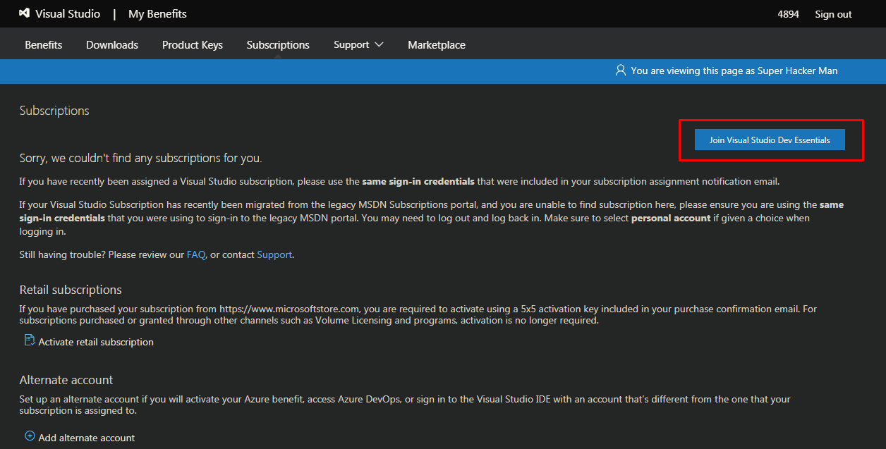

# Installing pin on windows and building your first pin tool
This guide is set up in a way to help beginners successfully build pin tools and run them on a windows machine. The first section will be installing and setup. 
We will use Visual Studios 2015 to build the tools and Cygwin to actually run the tool.

## Part 1
### Installing Pin
- [Pin Download link](https://software.intel.com/en-us/articles/pin-a-binary-instrumentation-tool-downloads)

- [Docs for more information](https://software.intel.com/sites/landingpage/pintool/docs/97619/Pin/html/index.html)

	- extract and rename the folder to pin
	- move pin folder to C:/

### Installing VS2015
- Install Visual Studio 2015 (2017 can work for 3.10 according to docs)
- [Join Microsoft dev essentials so that you can get an older version of MSVS](https://my.visualstudio.com/subscriptions)


 
- [Then you can download it from here (be careful of x64 vs x86)](https://my.visualstudio.com/Downloads?q=Visual%20Studio%202015%20with%20Update%203)
	- Make sure to install the c/c++ workspaces 

### Building The Tools
- Open C:\pin\source\tools\MyPinTool\MyPinTool.vcxproj in Visual Studio 


- expand the Source Files section.


- Edit the MyPinTool.cpp file and replace its content with the source code of your tool but to test you can use inscount0.cpp found at C:\pin\source\tools\ManualExamples\inscount0.cpp
- Ensure you set Release as Solution Configuration option:


- Right click on MyPinTool and select Properties
- Go to VC++ directories > Include Directories and add the following paths:
	C:\pin\source\include\pin;
	C:\pin\source\include\pin\gen;
	


- Add the following to Configuration Properties -> C/C++ -> Additional Include Directories
	..\..\..\extras\xed-ia32\include\xed
	


- Add this to Configuration Properties -> Linker -> Input -> Additional Dependencies
	crtbeginS.obj
	


- Set Configuration Properties -> Linker -> Advanced -> Image Has Safe Exception Handlers to
	No (/SAFESEH:NO)
	


You should be able to build the tools now with no errors (Ctrl+Shift+B or right click MyPinTool->Build)

### Transferring built tool to the School Computer
- Connect to the school vpn (anyc.vpn.gatech.edu) using Cisco AnyConnect Mobility Client
- Download WINSCP to transfer your built tool
- WINSCP to the prism server 
	- Hostname: scp.prism.gatech.edu

	 

Navigate to: 
```
	/nethome/{YOUR_USERNAME}/ECE/Desktop
```
Upload the zipped folder of MyPinTools (C:\pin\source\tools\MyPinTool)

### Transferring Built tool to Malware VM
To connect to the computer surrounding the VM you need to use xfreerdp 
The command will look something like:
```
xfreerdp /u:GTUSERNAME /d:AD /v:ece-4894-01.ece.gatech.edu 
```
if you are getting a certificate warning you may need to add /cert-ignore
if you would like to change the dimensions add /w:1800 /h:900
At this point the tool should have been built on your computer then compressed and transferred to the schools servers. We will now transfer the tool using a the COM1 port.
Move the file from where you uploaded it on the desktop to C:\vm_setup_bds

Open PowerShell on the 4894 computer you have connected to:
	Use instruction (make sure the malware VM is open): 
	Copy-vmfile ece-4894-vm c:\ -SourcePath C:\vm_setup_bds\FILE -createfullpath -filesource Host

It should be on the vm now
Unpack it and place it in the same place on pin (C:\pin\source\tools\MyPinTool on the vm)
Open Cygwin on desktop 
```
	Navigate to c:/pin
	cd /cygdrive/c/pin
```

Use this command to test if it works
```
c:/pin> ./pin.exe -t ./source/tools/MyPinTool/Release/MyPinTool.dll -- ./../Windows/System32/calc.exe
	this command has 3 parts
	PINEXE -t THE_TOOL_DLL_BEING_USED -- THE_PROGRAM_BEING_TESTED
```
output file should be in c:/pin and the console should also output the result


Transfer the files out using this as reference:
	[Link](https://charbelnemnom.com/2016/04/how-to-copy-files-between-the-guest-and-the-host-in-hyperv-with-powershell-direct/)


## Part 2
### Making the pin tool
First a warning. The program I will be working on is malware which is likely what people using this tutorial will also be working on. I have fully reverse engineered the program I will be working with, so I am confident that there will be no negative effects for the pin tool I will be writing.
The main command we will be relying on is:
PIN_AddSyscallEntryFunction
I will be finishing up the pin tool I am working on next week when my professor looks it over and someone who sets up the servers finishes one last part. I can not confidently complete the portions needed to continue this section of the malware
Take some time to read over the API references [here](https://software.intel.com/sites/landingpage/pintool/docs/97971/Pin/html/group__API__REF.html) to be familiar with the terms that will be used.


